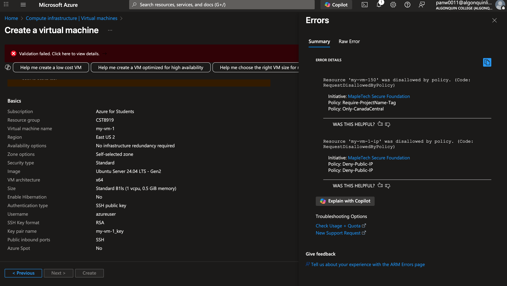
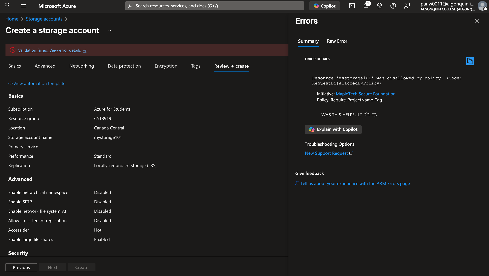
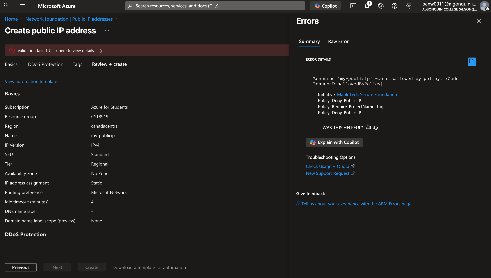
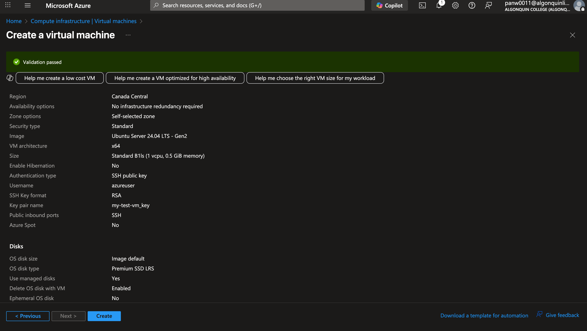

# 🛡️ Cloud Governance Gone Rogue – Azure Policy Lab

**Course**: CST8919 – DevOps Security and Compliance  
**Role**: Cloud Security Engineer at MapleTech Solutions

## 📝 Lab Summary

This lab demonstrates the enforcement of organizational cloud governance using Azure Policy. As a new Cloud Security Engineer at MapleTech Solutions, my mission was to restrict non-compliant deployments and enforce standards across our Azure environment. I achieved this by creating three custom Azure Policies, grouping them into a Policy Initiative, and assigning the initiative to a resource group to simulate real-world developer activities.

## 🚧 Defined Policies

### 1. 📍 Only-CanadaCentral
- **Effect**: `Deny`
- **Purpose**: Prevents deployment of any resource outside the Canada Central region.
- **Policy Rule**: Checks `location` field against "canadacentral".

### 2. 🏷️ Require-ProjectName-Tag
- **Effect**: `Deny`
- **Purpose**: Enforces the presence of a `ProjectName` tag on all resource deployments.
- **Policy Rule**: Uses `tags[ProjectName]` field and denies if it doesn't exist.

### 3. 🌐 Deny-Public-IP
- **Effect**: `Deny`
- **Purpose**: Blocks creation of public IP address resources to avoid exposure to the internet.
- **Policy Rule**: Denies creation of `Microsoft.Network/publicIPAddresses`.

All three policies were created using the Azure Portal with custom JSON definitions, which are included in the `policy-definitions` folder.

## 🧵 Policy Initiative

### MapleTech Secure Foundation
- **Type**: Initiative Definition
- **Included Policies**:
  - Only-CanadaCentral
  - Require-ProjectName-Tag
  - Deny-Public-IP
- **Category**: Security
- **Scope**: Assigned at the resource group level with enforcement mode set to **Enforce (deny)**

## 🧪 Test Results

| Test Case                                        | Expected Result | Actual Result | Screenshot                |
|--------------------------------------------------|------------------|----------------|---------------------------|
| Deploy VM in East US                             | ❌ Denied         | ✅ Confirmed    |  |
| Deploy Storage without `ProjectName` tag         | ❌ Denied         | ✅ Confirmed    |  |
| Create a Public IP                               | ❌ Denied         | ✅ Confirmed    |  |
| Deploy VM in Canada Central with `ProjectName` tag | ✅ Allowed        | ✅ Confirmed    |  |

## 🎥 Video Demonstration

▶️ [Click to Watch Demo (YouTube)](https://youtu.be/BH6m8XWg_z0)

> This video showcases policy definitions, initiative setup, and deployment testing, concluding with key takeaways.

## 📁 Repository Structure

```
/policy-lab
│
├── screenshots/
│   ├── vm-eastus-denied.png
│   ├── storage-no-tag-denied.png
│   ├── public-ip-denied.png
│   ├── vm-canada-central-allowed.png
│
├── policy-definitions/
│   ├── Only-CanadaCentral.json
│   ├── Require-ProjectName-Tag.json
│   ├── Deny-Public-IP.json
│
├── README.md
```

## 🔍 Challenges & Lessons Learned

- Faced initial issues with JSON formatting and parameter references.
- Learned the power of Azure Policy in enforcing enterprise-wide standards.
- Policy Initiatives help simplify bulk policy management and assignment.
- Tag enforcement can help with cost tracking, compliance, and resource grouping.

---

**✅ Status**: Lab completed successfully. All policies worked as intended and enforced compliance rules for secure and governed cloud usage.
